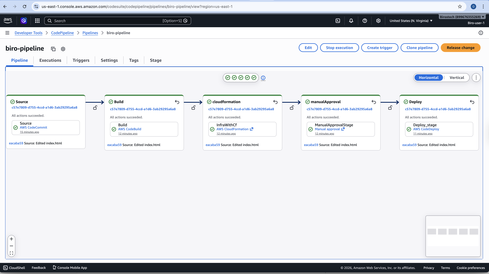
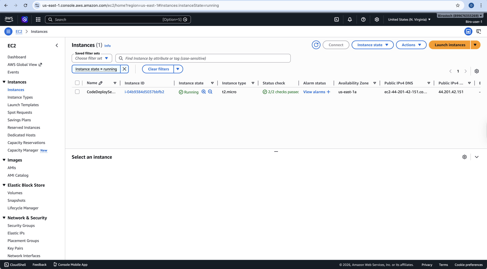
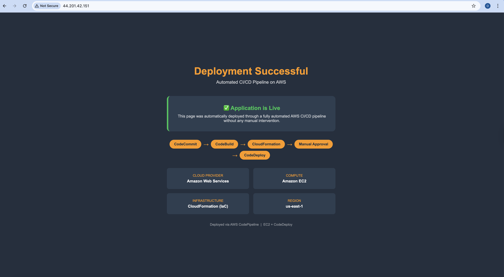

# CI/CD Pipeline with AWS CodePipeline

A fully automated CI/CD pipeline that provisions cloud infrastructure and deploys a web application to an EC2 instance using core AWS DevOps services.

---

## Architecture
CodeCommit → CodeBuild → CloudFormation → Manual Approval → CodeDeploy

---

## AWS Services Used

| Service | Role |
|---------|------|
| AWS CodeCommit | Source code repository |
| AWS CodeBuild | Build and test the application |
| AWS CloudFormation | Provision EC2 infrastructure as code |
| AWS CodeDeploy | Deploy application to EC2 instance |
| AWS CodePipeline | Orchestrate the entire CI/CD workflow |
| Amazon EC2 | Host the web application |
| Amazon S3 | Store pipeline artifacts |
| AWS IAM | Manage permissions across all services |

---

## Pipeline Stages

**1. Source**
Monitors the main branch in CodeCommit. Any code push automatically triggers the pipeline.

**2. Build**
CodeBuild runs the buildspec.yml which tests the application and packages it as an artifact for the next stage.

**3. CloudFormation**
Provisions the EC2 instance, IAM role, and Security Group automatically using Infrastructure as Code.

**4. Manual Approval**
Pipeline pauses and waits for a human reviewer to approve before deployment proceeds.

**5. Deploy**
CodeDeploy picks up the build artifact and deploys it to the EC2 instance using the appspec.yml configuration.

---

## Project Structure
CI-CD-with-AWS-CodePipeline/
├── index.html          # Web application
├── buildspec.yml       # CodeBuild build instructions
├── appspec.yml         # CodeDeploy deployment instructions
├── template.yaml       # CloudFormation infrastructure template
└── README.md           # Project documentation

---

## Infrastructure (CloudFormation)

The `template.yaml` provisions the following resources automatically:

- **EC2 Instance** — t2.micro running Amazon Linux 2
- **IAM Role** — with CodeDeploy and SSM permissions
- **Security Group** — allowing HTTP (80) and SSH (22) access
- **Instance Profile** — attaches IAM role to EC2 instance
- **Apache Web Server** — installed and configured via UserData
- **CodeDeploy Agent** — installed and running on the instance

> VPC and Subnet are passed as parameters making the template reusable across any AWS account.

---

## Key Files Explained

**buildspec.yml**
Tells CodeBuild to test the application and package all files as an artifact to hand off to CodePipeline.

**appspec.yml**
Tells CodeDeploy where to place the application files on the EC2 instance and which scripts to run before and after deployment.

**template.yaml**
CloudFormation template that provisions all required AWS infrastructure automatically — no manual resource creation needed.

---

## IAM Roles Required

| Role | Purpose |
|------|---------|
| AWSCodePipelineServiceRole | Orchestrates all pipeline stages |
| CodePipeline-CloudFormation-Role | Creates AWS resources via CloudFormation |
| CodeDeployServiceRole | Manages CodeDeploy deployments |
| EC2Role | Allows EC2 instance to access AWS services |

---

## Screenshots

### Pipeline Execution

### CloudFormation Stack

### Deployed Application

---

## Author

**Odubiro Olayemi**
AWS Certified - Cloud Practitioner | Solutions Architect Associate | CloudOps Engineer Associate | KCNA
GitHub: [@birostech]([https://github.com/Birostech](https://www.linkedin.com/in/olayemi-odubiro-3b1155142/))

---

## License
MIT
